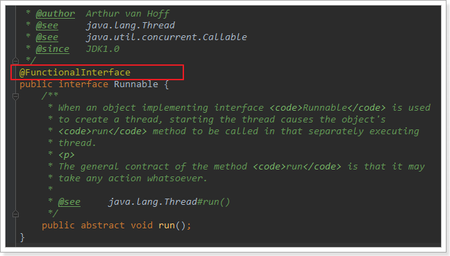

## 2. 函数式接口

经过前面的学习，相信大家对于Lambda表达式已经有了初步的了解。总结一下：

- Lambda表达式是接口的匿名内部类的简写形式
- 接口必须满足：内部只有一个函数

其实这样的接口，我们称为函数式接口，我们学过的`Runnable`、`Comparator`都是函数式接口的典型代表。但是在实践中，函数接口是非常脆弱的，只要有人在接口里添加多一个方法，那么这个接口就不是函数接口了，就会导致编译失败。Java 8提供了一个特殊的注解`@FunctionalInterface`来克服上面提到的脆弱性并且显示地表明函数接口。而且jdk8版本中，对很多已经存在的接口都添加了`@FunctionalInterface`注解，例如`Runnable`接口：



另外，Jdk8默认提供了一些函数式接口供我们使用：

### 2.1 Function类型接口

```java
@FunctionalInterface
public interface Function<T, R> {
	// 接收一个参数T，返回一个结果R
    R apply(T t);
}
```

Function代表的是有参数，有返回值的函数。还有很多类似的Function接口：

| 接口名                 | 描述                                            |
| :--------------------- | ----------------------------------------------- |
| `BiFunction<T,U,R>`    | 接收两个T和U类型的参数，并且返回R类型结果的函数 |
| `DoubleFunction<R>`    | 接收double类型参数，并且返回R类型结果的函数     |
| `IntFunction<R>`       | 接收int类型参数，并且返回R类型结果的函数        |
| `LongFunction<R>`      | 接收long类型参数，并且返回R类型结果的函数       |
| `ToDoubleFunction<T>`  | 接收T类型参数，并且返回double类型结果           |
| `ToIntFunction<T>`     | 接收T类型参数，并且返回int类型结果              |
| `ToLongFunction<T>`    | 接收T类型参数，并且返回long类型结果             |
| `DoubleToIntFunction`  | 接收double类型参数，返回int类型结果             |
| `DoubleToLongFunction` | 接收double类型参数，返回long类型结果            |

看出规律了吗？这些都是一类函数接口，在Function基础上衍生出的，要么明确了参数不确定返回结果，要么明确结果不知道参数类型，要么两者都知道。

### 2.2 Consumer系列

```java
@FunctionalInterface
public interface Consumer<T> {
	// 接收T类型参数，不返回结果
    void accept(T t);
}
```

Consumer系列与Function系列一样，有各种衍生接口，这里不一一列出了。不过都具备类似的特征：那就是不返回任何结果。


### 2.3 Predicate系列

```java
@FunctionalInterface
public interface Predicate<T> {
	// 接收T类型参数，返回boolean类型结果
    boolean test(T t);
}
```

Predicate系列参数不固定，但是返回的一定是boolean类型。

### 2.4 Supplier系列

```java
@FunctionalInterface
public interface Supplier<T> {
	// 无需参数，返回一个T类型结果
    T get();
}
```

Supplier系列，英文翻译就是“供应者”，顾名思义：只产出，不收取。所以不接受任何参数，返回T类型结果。